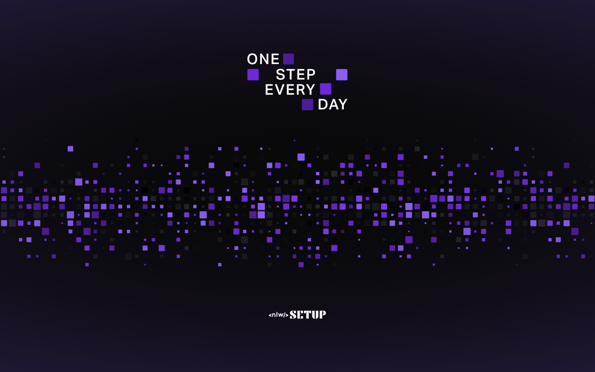

<p align="center">
  
</p>
<h3 align="center">
You are in control of your routine!
</h3>

<br><br>

<p align="center">
  
  
  
</p>
<br>

<p align="center">
  <a href="#about">About</a> •
  <a href="#habits">Habits</a> •
  <a href="#installation">installation</a> •
  <a href="#technology">technology</a> •
  <a href="#autor">Author</a>  
</p>

## About

Project developed during NLW Setup, an event created by Rocketseat. A 100% online and FREE event, with exclusive and UNPRECEDENTED content.

It took place from the 16th to the 20th of January 2023 and was intended to show in practice the power of the NodeJS + ReactJS + React Native stack and how these technologies can lead you to your biggest goals as a programmer.



## Habits

Habits is a daily task tracking app to help its users track their completed and unfulfilled activities.

The application flow is simple: the user registers the desired habits indicating which days of the week they should be performed and every day he will have a list of habits according to the current day, where he will indicate the status of each habit and the application will generate a daily progress that will be illustrated in the progress bar and also in the colors of the squares that represent the days where lighter colors represent greater numbers of complete habits.

The application has, in addition to the backend, a web and mobile application, which will be illustrated below.

## installation

Before starting, you will need to have the following tools installed on your machine:
[Git](https://git-scm.com), [Node.js](https://nodejs.org/en/).
Also it's nice to have an editor to work with the code like [VSCode](https://code.visualstudio.com/).

> ⚠ Before running the frontend and mobile check the IP of your machine and configure it in the axios setup file present in the lib folder of the respective projects

### 🎲 Back end running (server)

```bash
# Clone this repository
$ git clone git@github.com:glendson/server-habits.git
# Access project folder in terminal/cmd
$ cd server-habits
# Install the dependencies
$ npm install
# If you prefer to use Yarn, run the command below
$ yarn
# Run the application in development mode
$ npm run dev
# If you prefer to use Yarn, run the command below
$ yarn dev
# The server will start on port 3333 - acess <http://localhost:3333>
```

## Technology


<br><br><br><br>

## Author

<div align="center">

<h1>Glendson Garcete</h1>
<strong>FullStack Developer</strong>
<br/>
<br/>

<a href="https://www.linkedin.com/in/glendson-zeus-tomazetto-garcete-a2a0b190/" target="_blank">

</a>

<a href="https://github.com/glendson" target="_blank">

</a>

<a href="mailto:gztomazetto@gmail.com?subject=Fala%20Dev" target="_blank">

</a>


<br/>